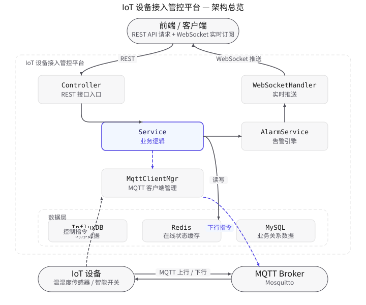

# IoT 设备接入管控平台 (IoT Device Platform)

> 面向中大型企业的 **SaaS 级** 物联网设备接入与管控平台，支持多租户隔离、Kafka 削峰、读写分离、自动扩缩容，单集群支撑百万设备接入与实时管控。

---

## 目录

- [SaaS 架构总览](#saas-架构总览)
- [多租户设计](#多租户设计)
- [核心功能](#核心功能)
- [设备认证鉴权](#设备认证鉴权)
- [OTA 固件升级](#ota-固件升级)
- [Drools 规则引擎](#drools-规则引擎)
- [前端可视化看板](#前端可视化看板)
- [能源管理 SaaS 模块](#能源管理-saas-模块)
- [技术栈](#技术栈)
- [快速启动](#快速启动)
- [生产部署](#生产部署)
- [API 概览](#api-概览)
- [MQTT Topic 规划](#mqtt-topic-规划)
- [物模型示例](#物模型示例)
- [监控告警](#监控告警)
- [项目结构](#项目结构)
- [CI/CD 流水线](#cicd-流水线)

---

## SaaS 架构总览

平台采用 **多租户 + 微服务就绪** 架构，设备通过 MQTT 接入，经 Kafka 削峰后异步落库，支持水平扩展至 3~10 个实例。



### SaaS 关键能力

| 能力 | 实现方案 | 说明 |
|------|---------|------|
| **多租户隔离** | MyBatis-Plus TenantLineInterceptor + `tenant_id` 字段 | 行级数据隔离，SQL 自动注入租户条件，零业务侵入 |
| **消息削峰** | Kafka 3分区 + 异步消费 | 设备数据先入 Kafka 再落库，支持 10k+ msg/s 削峰 |
| **读写分离** | dynamic-datasource + MySQL 主从 | 读操作路由到从库，写操作走主库，线性扩展读 QPS |
| **水平扩展** | K8s HPA + EMQX 共享订阅 | 3~10 Pod 自动扩缩容，MQTT 共享订阅避免消息重复 |
| **限流防护** | Redis + AOP RateLimit | 接口级限流，防止恶意请求打垮服务 |
| **安全防护** | CORS + XSS 过滤 + JWT | XSS 转义、跨域白名单、JWT 携带租户上下文 |
| **监控告警** | Actuator + Prometheus + Grafana | HTTP P99 延迟、JVM 内存、设备在线数等指标可视化 |
| **生产部署** | Docker 多阶段构建 + K8s 清单 + CI/CD | 全自动构建→推送→部署流水线 |

### 数据流说明

| 方向 | 通道 | 说明 |
|------|------|------|
| 设备 → 平台 | MQTT 上行 | 设备连接、属性上报、事件、心跳、指令响应 |
| 平台 → Kafka | 异步队列 | MQTT 收到数据后投递到 Kafka topic，解耦写入压力 |
| Kafka → 落库 | 异步消费 | 消费者批量写入 InfluxDB，3 并发消费线程 |
| 平台 → 设备 | MQTT 下行 | 控制指令下发 |
| 平台 → 前端 | WebSocket | 设备状态变更、实时属性数据、告警事件实时推送 |
| 前端 → 平台 | REST API | 设备注册、查询、控制、告警查询（JWT 认证） |

---

## 多租户设计

### 租户隔离机制

```
请求入口 (HTTP/MQTT)
    │
    ├── HTTP 请求: JWT 解析 tenantId → TenantContext (ThreadLocal)
    │
    └── MQTT 消息: device.tenantId 自动注入 → TenantContext
            │
            ▼
    MyBatis-Plus TenantLineInterceptor
            │
            ▼
    SQL 自动追加: WHERE tenant_id = #{tenantId}
```

### 租户表结构

```sql
CREATE TABLE `tenant` (
    `id`              BIGINT       NOT NULL AUTO_INCREMENT,
    `tenant_code`     VARCHAR(64)  NOT NULL COMMENT '租户编码',
    `tenant_name`     VARCHAR(128) NOT NULL COMMENT '租户名称',
    `status`          TINYINT      DEFAULT 1 COMMENT '0-禁用 1-启用',
    `device_limit`    INT          DEFAULT 10000 COMMENT '设备数量上限',
    `mqtt_user`       VARCHAR(128) COMMENT 'MQTT 认证用户名',
    `expire_time`     DATETIME     COMMENT '到期时间',
    PRIMARY KEY (`id`),
    UNIQUE KEY `uk_tenant_code` (`tenant_code`)
);
```

所有业务表（`device`、`product`、`alarm`、`user`、`thing_model`）均包含 `tenant_id` 字段并建立索引，MyBatis-Plus 拦截器在 SQL 执行前自动注入租户条件，业务代码无感知。

### 核心组件

| 组件 | 路径 | 职责 |
|------|------|------|
| `TenantContext` | `tenant/TenantContext.java` | ThreadLocal 存储当前请求的租户 ID |
| `TenantLineHandlerImpl` | `tenant/TenantLineHandlerImpl.java` | MyBatis-Plus 租户拦截器，自动注入 SQL 条件 |
| `AuthInterceptor` | `config/AuthInterceptor.java` | 从 JWT 提取 tenantId 并设置到 TenantContext |
| `TenantMapper` | `repository/TenantMapper.java` | 租户管理 CRUD |

---

## 核心功能

1. **多租户设备接入**：每个租户独立管理设备/产品/告警，数据行级隔离，支持设备配额限制。
2. **设备接入管理**：设备注册（关联产品）、设备列表/详情查询、设备删除；设备通过 MQTT 连接后自动上线，状态实时同步至 Redis 缓存。
3. **物模型管理**：以产品为载体定义物模型（属性 property、事件 event、服务 service），设备注册时继承物模型，平台据此进行数据校验与阈值告警。
4. **Kafka 异步数据处理**：设备上报数据先入 Kafka 队列，消费者批量写入 InfluxDB，削峰填谷，支持高并发上报。
5. **告警引擎**：基于物模型阈值配置（min/max + alarmLevel），上报数据超阈值自动生成告警（INFO/WARNING/CRITICAL 三级），告警实时推送前端。
6. **远程控制**：前端调用 REST API 下发控制指令，平台通过 MQTT 推送到设备，同步等待设备执行响应（默认超时 30 秒）。
7. **心跳检测**：定时任务每 60 秒扫描设备心跳，超过 90 秒未上报的设备自动置为 OFFLINE 并产生离线告警。
8. **接口限流**：基于 Redis 的令牌桶限流，按接口维度配置 QPS 上限，防止突发流量打垮服务。
9. **设备认证鉴权**：基于 EMQX HTTP Auth 插件实现 per-device 身份认证，每台设备独立 deviceSecret，ACL 粒度控制 Topic 发布/订阅权限，Redis 缓存认证结果降低 DB 压力。
10. **OTA 固件升级**：支持固件包管理（上传/发布/废弃）、批量升级任务编排（全量/按产品/指定设备）、分批策略（立即/定时）、MQTT 下发升级指令、设备进度实时上报与任务完成 WebSocket 推送。
11. **Drools 规则引擎**：集成 Drools 8.44 动态规则引擎，支持 DRL 规则热加载、复合条件告警（如"低电量 + 信号弱"）、规则 CRUD 与即时重载、规则试跑测试。
12. **前端可视化看板**：独立 HTML 单页看板，WebSocket 实时推送设备状态与告警，Chart.js 渲染趋势图/饼图/柱状图，支持设备列表、告警列表、OTA 进度等模块切换。

---

## 设备认证鉴权

### 架构说明

平台通过 EMQX 的 HTTP Auth 插件实现 **per-device 身份认证**，每台设备在注册时分配独立的 `deviceSecret`，EMQX 在设备连接和发布/订阅前回调平台接口进行校验。

```
设备 --MQTT连接--> EMQX --HTTP POST /mqtt/auth--> 平台校验 deviceId + deviceSecret
设备 --发布/订阅--> EMQX --HTTP POST /mqtt/acl---> 平台校验 Topic 权限
```

### 认证流程

| 步骤 | 说明 |
|------|------|
| 设备注册 | 平台为每台设备生成 `deviceSecret`，存入 `device` 表 |
| EMQX 配置 | 在 EMQX Dashboard 配置 HTTP Auth 插件，指向 `http://platform:8080/mqtt/auth` 和 `/mqtt/acl` |
| 连接认证 | 设备以 `username=deviceId, password=deviceSecret` 连接 EMQX，EMQX 回调 `/mqtt/auth` |
| ACL 鉴权 | 设备发布/订阅时 EMQX 回调 `/mqtt/acl`，校验设备仅能操作 `iot/device/{自身deviceId}/#` 主题 |
| 缓存优化 | 认证结果缓存至 Redis（5 分钟 TTL），降低高频回调对数据库的冲击 |

### 核心组件

| 组件 | 路径 | 职责 |
|------|------|------|
| `MqttAuthController` | `controller/MqttAuthController.java` | EMQX 认证/ACL 回调端点，返回 `{result: allow/deny}` |
| `MqttAuthServiceImpl` | `service/impl/MqttAuthServiceImpl.java` | 认证逻辑：DeviceSecret 校验 + Redis 缓存 + Topic ACL |
| `Device.deviceSecret` | `model/entity/Device.java` | 设备密钥字段，注册时自动生成 |

### EMQX 配置指南

详细配置步骤请参考 [docs/emqx-auth-setup.md](docs/emqx-auth-setup.md)。

---

## OTA 固件升级

### 架构说明

平台提供完整的 OTA（Over-The-Air）固件升级能力，支持固件版本管理、批量任务编排、MQTT 指令下发与设备进度追踪。

```
固件上传(DRAFT) → 发布(PUBLISHED) → 创建升级任务 → MQTT下发升级指令
                                                    ↓
设备下载固件 → 上报进度(DOWNLOADING/INSTALLING) → 成功/失败 → 任务统计更新 → WebSocket推送前端
```

### 核心流程

| 阶段 | 说明 |
|------|------|
| 固件管理 | 上传固件包元信息（版本/URL/MD5/SHA256），默认 DRAFT 状态，发布后可被任务引用 |
| 任务编排 | 支持三种目标范围：`ALL`（全量）、`BY_PRODUCT`（按产品）、`SELECTED`（指定设备）；两种策略：`IMMEDIATE`（立即）、`SCHEDULED`（定时） |
| 指令下发 | 通过 MQTT Topic `iot/device/{deviceId}/ota/command` 下发升级指令，包含固件 URL、版本号、校验和 |
| 进度追踪 | 设备通过 MQTT 上报 `DOWNLOADING → INSTALLING → SUCCESS/FAILED`，平台更新进度记录与任务统计 |
| 完成通知 | 任务全部设备终态后置为 COMPLETED，WebSocket 推送任务完成摘要 |

### 数据模型

| 实体 | 说明 |
|------|------|
| `Firmware` | 固件包：版本、文件URL、文件大小、MD5/SHA256校验和、状态（DRAFT/PUBLISHED/DEPRECATED） |
| `OtaTask` | 升级任务：固件ID、目标范围、策略、状态（PENDING/RUNNING/COMPLETED/CANCELLED）、设备总数/成功数/失败数 |
| `OtaDeviceProgress` | 设备升级进度：任务ID、设备ID、当前版本、目标版本、状态（PENDING/DOWNLOADING/INSTALLING/SUCCESS/FAILED） |

### MQTT Topic

| 方向 | Topic | 说明 |
|------|-------|------|
| 下行 | `iot/device/{deviceId}/ota/command` | 平台下发升级指令（含固件URL、版本、校验和） |
| 上行 | `iot/device/{deviceId}/ota/progress` | 设备上报升级进度（状态、错误信息） |

---

## Drools 规则引擎

### 架构说明

平台集成 Drools 8.44 规则引擎，将告警逻辑从硬编码解耦为可动态管理的 DRL 规则文件，支持复合条件告警与规则热加载。

```
设备上报数据 → 构造 DevicePropertyFact → KieSession.fireAllRules() → 触发规则 → 生成 AlarmResult → 落库告警
```

### 核心能力

| 能力 | 说明 |
|------|------|
| 动态规则加载 | 启动时加载 `classpath:rules/default-alarm-rules.drl` + 数据库启用规则，编译为 KieContainer |
| 规则热重载 | 规则 CRUD 后自动 `reloadRules()`，重新编译全部规则替换 KieContainer（无停机） |
| 复合条件告警 | 支持多属性联合判断，如"电量 < 20% 且信号强度 < -90dBm"触发复合告警 |
| 规则试跑 | `testRule()` 接口可在不落库的情况下试跑规则，验证规则正确性 |
| 规则优先级 | 支持 `salience` 设定规则优先级，`no-loop` 防止规则递归触发 |

### 默认规则示例

```drl
// 温度超阈值告警（CRITICAL）
rule "Temperature Over Threshold Critical"
    salience 100
    no-loop true
    when
        $fact : DevicePropertyFact($t : getDouble("temperature"), $t != null, $t > 50.0)
    then
        AlarmResult result = new AlarmResult();
        result.setDeviceId($fact.getDeviceId());
        result.setLevel("CRITICAL");
        result.setTitle("温度超阈值告警");
        result.setContent("设备 " + $fact.getDeviceId() + " 温度 " + $t + " 超过阈值 50.0℃");
        $fact.addResult(result);
end

// 电池低电量 + 信号弱复合告警（WARNING）
rule "Battery Low and Offline Risk Warning"
    salience 50
    no-loop true
    when
        $fact : DevicePropertyFact(
            $bat : getDouble("battery"), $bat != null, $bat < 20.0,
            $sig : getDouble("signalStrength"), $sig != null, $sig < -90.0
        )
    then
        AlarmResult result = new AlarmResult();
        result.setDeviceId($fact.getDeviceId());
        result.setLevel("WARNING");
        result.setType("COMPOSITE");
        result.setTitle("电池低电量且信号弱复合告警");
        $fact.addResult(result);
end
```

### 核心组件

| 组件 | 路径 | 职责 |
|------|------|------|
| `DroolsConfig` | `config/DroolsConfig.java` | KieServices/KieContainer Bean 配置 |
| `RuleEngineServiceImpl` | `service/impl/RuleEngineServiceImpl.java` | 规则加载、评估、CRUD、热重载 |
| `RuleController` | `controller/RuleController.java` | 规则管理 REST API |
| `default-alarm-rules.drl` | `resources/rules/default-alarm-rules.drl` | 默认告警规则集 |
| `DevicePropertyFact` | `model/dto/DevicePropertyFact.java` | 规则事实对象，封装设备属性 Map |
| `AlarmResult` | `model/dto/AlarmResult.java` | 规则输出对象，告警结果 |

---

## 前端可视化看板

### 看板说明

平台提供独立的前端可视化看板（`frontend/index.html`），无需额外构建工具，浏览器直接打开即可使用。通过 WebSocket 实时接收设备状态与告警，使用 Chart.js 渲染数据图表。

### 功能模块

| 模块 | 说明 |
|------|------|
| 概览看板 | 设备总数、在线数、离线数、告警数统计卡片，实时更新 |
| 实时数据趋势 | WebSocket 推送的设备属性数据，Chart.js 折线图实时滚动 |
| 设备状态分布 | 在线/离线/告警设备占比饼图 |
| 设备列表 | 设备 ID、产品、状态、最后上报时间，支持搜索过滤 |
| 告警列表 | 最新告警事件，按级别（CRITICAL/WARNING/INFO）颜色区分 |
| OTA 升级进度 | 升级任务列表与设备进度实时展示 |
| 规则管理 | Drools 规则列表查看、启用/禁用操作 |

### 使用方式

```bash
# 1. 启动后端服务
mvn clean package -DskipTests
java -jar target/iot-device-platform-1.0.0.jar

# 2. 浏览器打开看板
open frontend/index.html

# 3. 在看板顶栏输入 JWT Token 建立 WebSocket 连接
```

看板自动连接 `ws://localhost:8080/iot/ws/device`，实时接收设备状态变更、属性上报和告警事件。

---

## 能源管理 SaaS 模块

在 IoT 设备管控中台基础上，平台扩展了能源管理 SaaS 能力，覆盖 P0（上线前必须完成）和 P1（差异化竞争力）两批模块。

### P0 核心模块（上线前必须完成）

#### 电表/水表/燃气表数据采集

支持电力参数（电压/电流/功率因数/电量）、水气参数采集，对接 Modbus 工业电表通过 MQTT 网关上报。

| 组件 | 路径 | 职责 |
|------|------|------|
| `EnergyMeter` | `model/entity/EnergyMeter.java` | 能源表实体（电表/水表/燃气表，Modbus/MQTT 协议） |
| `EnergyReading` | `model/entity/EnergyReading.java` | 能耗读数实体（电压/电流/功率/用电量/峰谷标志） |
| `EnergyMeterController` | `controller/EnergyMeterController.java` | 能源表 CRUD + 最新读数查询 |
| `EnergyDataController` | `controller/EnergyDataController.java` | 能耗历史查询 + 实时读数 + 今日汇总 |
| `EnergyMeterServiceImpl` | `service/impl/EnergyMeterServiceImpl.java` | MQTT 能耗数据处理 + 峰谷判断 + Redis 缓存 |

**MQTT Topic**: `iot/device/{deviceId}/energy` — 设备上报能耗数据，平台自动判断峰(8-11h/18-21h)、谷(0-7h)、平(其他)时段。

#### 能耗分析报表

基于时序数据做日/周/月能耗聚合，生成同比环比分析、峰谷平电量统计、功率因数分析。

| 功能 | 说明 |
|------|------|
| 日报生成 | 按日聚合能耗数据，计算总用电量/峰谷平/最大需量/平均功率因数/电费 |
| 月报生成 | 按月聚合，含同比环比对比 |
| 能耗趋势 | 指定时间范围内的能耗趋势图数据 |
| 峰谷平分析 | 峰(1.0元/kWh)/平(0.6元)/谷(0.3元)用电量与电费占比分析 |

**核心组件**: `EnergyAnalysisServiceImpl`、`EnergyReportController`(`/iot/energy/report`)

#### 碳排放核算

按排放因子法将能耗数据折算为 CO2 排放量，支持 Scope 1（直接排放）+ Scope 2（外购电力排放）。

| 排放源 | Scope | 排放因子 | 单位 |
|--------|-------|---------|------|
| 电力（中国电网平均） | Scope 2 | 0.5810 | kgCO2/kWh |
| 天然气 | Scope 1 | 2.1622 | kgCO2/m³ |
| 柴油 | Scope 1 | 2.7301 | kgCO2/L |
| 煤炭 | Scope 1 | 1.9776 | kgCO2/kg |

**核心组件**: `CarbonEmissionServiceImpl`、`CarbonEmissionController`(`/iot/carbon`)、`EmissionFactor` 实体

#### 数据导出与 API 对接

支持导出 Excel/PDF 报表（政府补贴申报需要），提供 REST API 供客户现有系统对接。

| 导出类型 | 格式 | 说明 |
|----------|------|------|
| 能耗报表 | Excel (Apache POI) | 时间/电表/电压/电流/功率/功率因数/用电量/峰谷标志 |
| 能耗报表 | PDF | HTML 转 PDF 格式 |
| 碳排报告 | Excel | 按能源表汇总碳排放数据 |

**核心组件**: `DataExportServiceImpl`、`DataExportController`(`/iot/export`)，Excel 不可用时自动降级为 CSV

### P1 差异化模块（3-6 个月迭代）

#### 能耗预警规则引擎

复用 Drools 规则引擎，扩展 5 条能耗专属告警规则（`rules/energy-alarm-rules.drl`）:

| 规则 | 级别 | 触发条件 |
|------|------|---------|
| 功率越限告警 | CRITICAL | activePower > 1000 kW |
| 峰时段超限告警 | WARNING | activePower > 800 且处于峰时段 |
| 非工作时段异常用电 | WARNING | activePower > 100 且 22:00 后 |
| 功率因数过低 | INFO | powerFactor < 0.8 |
| 能耗突增告警 | WARNING | energyConsumption > 500 kWh |

#### 负荷调度策略

复用远程控制通道，下发"空调温度上调""充电桩功率限制"等指令，实现削峰填谷。

| 策略类型 | 动作类型 | 说明 |
|----------|---------|------|
| 峰荷削减 (PEAK_SHAVING) | AC_TEMP_ADJUST | 峰时段空调温度上调 |
| 峰荷削减 | EV_CHARGE_LIMIT | 充电桩功率限制 |
| 谷荷填充 (VALLEY_FILLING) | DEVICE_SHUTDOWN | 非关键设备关停 |
| 需求响应 (DEMAND_RESPONSE) | LIGHT_DIM | 照明调暗 |

**核心组件**: `LoadDispatchServiceImpl`、`LoadDispatchController`(`/iot/dispatch`)，支持手动执行与自动触发

#### 碳排报告自动生成

生成符合生态环境部要求的碳排放月度/年度报告，含排放汇总、来源分布、按日趋势、节能建议。

**核心组件**: `CarbonReportServiceImpl`、`CarbonReportController`(`/iot/carbon/report`)，支持 PDF 导出

#### 移动端 H5 看板

独立移动端 H5 页面（`frontend/mobile.html`），管理者随时查看能耗数据:

- 能源概览卡片（今日/本月用电量、碳排放、实时功率）
- 24小时功率曲线、峰谷平用电占比、7日能耗趋势
- 实时告警列表、电表列表
- 底部导航：首页/电表/报表/告警/我的
- WebSocket 实时数据推送

---

## 技术栈

| 类别 | 技术 | 版本 | 说明 |
|------|------|------|------|
| 语言/框架 | Java + Spring Boot | 17 / 3.2 | 核心框架 |
| 设备通信 | Eclipse Paho MQTT | 1.2.5 | MQTT 客户端，EMQX 共享订阅 |
| 消息队列 | Apache Kafka | 3.7 | 设备数据削峰、异步解耦 |
| 关系型数据库 | MyBatis-Plus + MySQL | 3.5.5 / 8.0 | 主从读写分离 |
| 动态数据源 | dynamic-datasource | 4.3.1 | 读写分离路由 |
| 时序数据库 | InfluxDB 2.0 | 2.7 | 设备上报数据时序存储 |
| 实时推送 | WebSocket (Spring) | - | 设备状态实时推送到前端 |
| 缓存 | Redis | 7 | 设备状态缓存 + 限流 + 告警去重 |
| 安全 | CORS + XSS Filter + JWT | - | 跨域防护 + XSS 转义 + 租户级认证 |
| 监控 | Actuator + Micrometer + Prometheus | - | 指标采集 + P99 分位统计 |
| 可视化 | Grafana | latest | 监控面板 |
| 规则引擎 | Drools | 8.44.0.Final | 复杂告警规则动态管理与热加载 |
| 前端看板 | Chart.js + WebSocket | 4.4.1 | 独立 HTML 可视化看板，实时数据推送 |
| 数据导出 | Apache POI + EasyExcel | 5.2.5 / 3.3.4 | Excel/PDF 报表导出 |
| 能源管理 | 自研模块 | - | 能耗采集/分析报表/碳排放核算/负荷调度 |
| API 文档 | Knife4j (OpenAPI 3) | 4.5.0 | 接口文档 |
| 容器化 | Docker + Docker Compose | - | 多阶段构建 + 基础设施编排 |
| 编排 | Kubernetes | - | HPA 自动扩缩容 + Ingress |
| CI/CD | GitHub Actions | - | 编译→测试→镜像推送→K8s 部署 |

---

## 快速启动

### 前置条件

- JDK 17+
- Maven 3.8+
- Docker & Docker Compose

### 1. 启动基础设施（开发环境）

```bash
cd iot-device-platform
docker-compose up -d
```

| 服务 | 端口 | 说明 |
|------|------|------|
| MySQL 8.0 | 3306 | 关系型数据库（自动执行 `init.sql`） |
| Redis | 6379 | 缓存 |
| Mosquitto (MQTT Broker) | 1883 / 9001 | MQTT 消息代理 |
| InfluxDB 2.0 | 8086 | 时序数据库 |

### 2. 编译并运行平台

```bash
mvn clean package -DskipTests
java -jar target/iot-device-platform-1.0.0.jar
```

### 3. 验证启动

- API 文档（Knife4j）：http://localhost:8080/iot/doc.html
- Swagger UI：http://localhost:8080/iot/swagger-ui.html
- 健康检查：http://localhost:8080/iot/actuator/health
- Prometheus 指标：http://localhost:8080/iot/actuator/prometheus

### 4. 模拟设备接入（可选）

```bash
# 模拟设备上线
mosquitto_pub -h localhost -p 1883 -t "iot/device/device_001/connect" \
  -m '{"ip":"192.168.1.100","firmwareVersion":"v1.0.0"}'

# 模拟设备上报属性（温度 45℃ 触发严重告警）
mosquitto_pub -h localhost -p 1883 -t "iot/device/device_001/property" \
  -m '{"temperature":45,"humidity":55,"battery":80}'

# 模拟设备心跳
mosquitto_pub -h localhost -p 1883 -t "iot/device/device_001/heartbeat" \
  -m '{"timestamp":1710000000000}'
```

---

## 生产部署

### Docker Compose 生产环境

```bash
# 启动全部生产基础设施（MySQL主从 + Redis + EMQX + Kafka + InfluxDB + Prometheus + Grafana）
docker-compose -f docker-compose-prod.yml up -d

# 编译并启动应用
mvn clean package -DskipTests
java -jar -Dspring.profiles.active=prod target/iot-device-platform-1.0.0.jar
```

生产环境额外组件：

| 服务 | 端口 | 说明 |
|------|------|------|
| MySQL 主库 | 3306 | 写入（GTID 复制） |
| MySQL 从库 | 3307 | 只读 |
| EMQX Dashboard | 18083 | MQTT Broker 管理界面 |
| Kafka | 9092 | 消息队列 |
| InfluxDB | 8086 | 时序数据 |
| Prometheus | 9090 | 指标采集 |
| Grafana | 3000 | 监控看板 (admin/grafana123) |

### Kubernetes 部署

```bash
# 应用 K8s 清单（Namespace + ConfigMap + Secret + Deployment + Service + HPA + Ingress）
kubectl apply -f k8s/deployment.yaml
```

K8s 部署规格：

| 资源 | 配置 |
|------|------|
| 副本数 | 3（HPA 自动扩至 10） |
| CPU | 请求 500m，限制 2000m |
| 内存 | 请求 512Mi，限制 1536Mi |
| HPA 触发 | CPU > 70% 或 内存 > 80% |
| 健康检查 | Liveness `/iot/actuator/health/liveness`，Readiness `/iot/actuator/health/readiness` |
| Ingress | `iot.example.com`（Nginx Ingress） |

### Docker 镜像

```bash
# 多阶段构建（Maven 编译 → JRE 运行）
docker build -t yuanyunyang/iot-device-platform:latest .

# 运行
docker run -d -p 8080:8080 \
  -e SPRING_PROFILES_ACTIVE=prod \
  -e DB_HOST=your-mysql-host \
  -e REDIS_HOST=your-redis-host \
  -e KAFKA_SERVERS=your-kafka:9092 \
  yuanyunyang/iot-device-platform:latest
```

---

## API 概览

所有接口统一前缀：`/iot`，统一返回 `Result` 结构 `{code, message, data, timestamp}`，JWT 认证后自动注入租户上下文。

### 认证

| 方法 | 路径 | 说明 |
|------|------|------|
| POST | `/iot/auth/login` | 登录（返回 JWT，包含 tenantId） |
| POST | `/iot/user/register` | 注册用户 |

### 设备管理

| 方法 | 路径 | 说明 |
|------|------|------|
| POST | `/iot/device/register` | 注册设备（关联产品，继承物模型） |
| GET | `/iot/device/{deviceId}` | 查询设备详情及实时状态 |
| GET | `/iot/device/list` | 分页查询设备列表（支持状态过滤） |
| DELETE | `/iot/device/{deviceId}` | 删除设备 |
| POST | `/iot/device/control` | 远程控制设备（同步等待响应） |

### 产品物模型管理

| 方法 | 路径 | 说明 |
|------|------|------|
| POST | `/iot/product` | 创建产品 |
| GET | `/iot/product/list` | 查询产品列表 |
| GET | `/iot/product/{productKey}` | 查询产品详情 |
| POST | `/iot/product/{productId}/thing-model` | 保存物模型定义 |
| GET | `/iot/product/{productId}/thing-model` | 查询物模型定义 |

### 告警查询

| 方法 | 路径 | 说明 |
|------|------|------|
| GET | `/iot/alarm/device/{deviceId}` | 按设备查询告警（支持等级过滤） |
| GET | `/iot/alarm/recent` | 查询最近告警列表 |

### 实时监控

| 方法 | 路径 | 说明 |
|------|------|------|
| GET | `/iot/monitor/history/{deviceId}` | 查询设备历史监控数据（InfluxDB） |

### WebSocket 实时推送

| 端点 | 说明 |
|------|------|
| `ws://localhost:8080/iot/ws/device` | 订阅全局设备事件 |
| `ws://localhost:8080/iot/ws/device?deviceId=device_001` | 订阅指定设备的实时数据 |

### MQTT 设备认证

| 方法 | 路径 | 说明 |
|------|------|------|
| POST | `/mqtt/auth` | EMQX 认证回调（校验 deviceId + deviceSecret） |
| POST | `/mqtt/acl` | EMQX ACL 回调（校验 Topic 发布/订阅权限） |

### OTA 固件升级

| 方法 | 路径 | 说明 |
|------|------|------|
| POST | `/iot/ota/firmware` | 上传固件包 |
| POST | `/iot/ota/firmware/{firmwareId}/publish` | 发布固件 |
| GET | `/iot/ota/firmware/list` | 固件列表 |
| POST | `/iot/ota/task` | 创建升级任务 |
| GET | `/iot/ota/task/{taskId}` | 任务详情（含设备进度） |
| GET | `/iot/ota/task/list` | 任务列表 |
| POST | `/iot/ota/task/{taskId}/cancel` | 取消升级任务 |
| GET | `/iot/ota/device/{deviceId}/progress` | 设备升级进度 |

### 规则引擎管理

| 方法 | 路径 | 说明 |
|------|------|------|
| GET | `/iot/rule/list` | 规则列表 |
| POST | `/iot/rule` | 新增规则（DRL 内容） |
| PUT | `/iot/rule` | 更新规则 |
| DELETE | `/iot/rule/{id}` | 删除规则 |
| PUT | `/iot/rule/{id}/enable` | 启用/禁用规则 |
| POST | `/iot/rule/test` | 规则试跑（不落库） |
| POST | `/iot/rule/reload` | 手动重载全部规则 |

### 能源管理

| 方法 | 路径 | 说明 |
|------|------|------|
| POST | `/iot/energy/meter` | 创建能源表（电表/水表/燃气表） |
| GET | `/iot/energy/meter/{id}` | 能源表详情 |
| GET | `/iot/energy/meter/list` | 能源表列表 |
| GET | `/iot/energy/meter/{meterCode}/latest` | 最新读数 |
| GET | `/iot/energy/data/history/{meterCode}` | 能耗历史数据 |
| GET | `/iot/energy/data/realtime/{meterCode}` | 实时读数 |
| GET | `/iot/energy/data/summary/{meterCode}` | 今日能耗汇总 |
| POST | `/iot/energy/report/daily/{meterId}` | 生成日报 |
| POST | `/iot/energy/report/monthly/{meterId}` | 生成月报 |
| GET | `/iot/energy/report/list` | 报表列表 |
| GET | `/iot/energy/report/trend` | 能耗趋势 |
| GET | `/iot/energy/report/peak-valley` | 峰谷平分析 |

### 碳排放核算

| 方法 | 路径 | 说明 |
|------|------|------|
| GET | `/iot/carbon/calculate` | 计算碳排放 |
| GET | `/iot/carbon/list` | 碳排记录列表 |
| GET | `/iot/carbon/summary` | 碳排汇总 |
| POST | `/iot/carbon/factor` | 添加排放因子 |
| GET | `/iot/carbon/factor/list` | 排放因子列表 |
| POST | `/iot/carbon/factor/init` | 初始化默认因子 |
| GET | `/iot/carbon/report/monthly` | 碳排月度报告 |
| GET | `/iot/carbon/report/annual` | 碳排年度报告 |
| GET | `/iot/carbon/report/export` | 导出碳排报告 |

### 负荷调度

| 方法 | 路径 | 说明 |
|------|------|------|
| POST | `/iot/dispatch/strategy` | 创建调度策略 |
| POST | `/iot/dispatch/strategy/{id}/execute` | 手动执行策略 |
| POST | `/iot/dispatch/auto` | 触发自动调度 |
| GET | `/iot/dispatch/strategy/list` | 策略列表 |
| PUT | `/iot/dispatch/strategy/{id}/enable` | 启用/禁用策略 |
| DELETE | `/iot/dispatch/strategy/{id}` | 删除策略 |
| GET | `/iot/dispatch/history` | 执行历史 |

### 数据导出

| 方法 | 路径 | 说明 |
|------|------|------|
| GET | `/iot/export/energy/excel` | 导出能耗 Excel |
| GET | `/iot/export/energy/pdf` | 导出能耗 PDF |
| GET | `/iot/export/carbon/excel` | 导出碳排 Excel |

---

## MQTT Topic 规划

Topic 命名规范：`iot/device/{deviceId}/{消息类型}`

| 方向 | Topic | 说明 |
|------|-------|------|
| 上行 | `iot/device/{deviceId}/connect` | 设备上线连接 |
| 上行 | `iot/device/{deviceId}/property` | 属性数据上报 |
| 上行 | `iot/device/{deviceId}/event` | 事件上报 |
| 上行 | `iot/device/{deviceId}/lifecycle` | 生命周期事件 |
| 上行 | `iot/device/{deviceId}/heartbeat` | 心跳上报 |
| 上行 | `iot/device/{deviceId}/command/resp` | 控制指令响应 |
| 上行 | `iot/device/{deviceId}/ota/progress` | OTA 升级进度上报 |
| 上行 | `iot/device/{deviceId}/energy` | 能耗数据上报（电压/电流/功率/用电量） |
| 下行 | `iot/device/{deviceId}/command` | 平台下发控制指令 |
| 下行 | `iot/device/{deviceId}/ota/command` | 平台下发 OTA 升级指令 |

多实例部署时使用 EMQX 共享订阅 `$share/iot-platform/iot/device/#`，确保每条消息只被一个实例消费。

---

## 物模型示例

```json
[
  {
    "identifier": "temperature",
    "name": "温度",
    "type": "property",
    "dataType": "float",
    "unit": "℃",
    "minValue": -20,
    "maxValue": 40,
    "alarmLevel": "CRITICAL",
    "description": "环境温度，超过40℃触发严重告警"
  },
  {
    "identifier": "battery",
    "name": "电量",
    "type": "property",
    "dataType": "int",
    "unit": "%",
    "minValue": 20,
    "maxValue": null,
    "alarmLevel": "WARNING",
    "description": "电池电量百分比，低于20%触发告警"
  }
]
```

---

## 监控告警

### Prometheus 指标

| 指标 | 类型 | 说明 |
|------|------|------|
| `http_server_requests_seconds` | Timer | HTTP 请求延迟（P50/P95/P99） |
| `jvm_memory_used_bytes` | Gauge | JVM 内存使用 |
| `jvm_threads_live_threads` | Gauge | JVM 线程数 |
| `process_cpu_usage` | Gauge | 进程 CPU 使用率 |
| `hikaricp_connections_active` | Gauge | 数据库连接池活跃连接 |

### Grafana 看板

启动后访问 `http://localhost:3000`（admin/grafana123），添加 Prometheus 数据源 `http://prometheus:9090`，导入看板。

### Actuator 端点

| 端点 | 说明 |
|------|------|
| `/iot/actuator/health` | 健康检查（含 DB/Redis 状态） |
| `/iot/actuator/prometheus` | Prometheus 指标抓取 |
| `/iot/actuator/metrics` | 指标列表 |
| `/iot/actuator/env` | 环境变量（需授权） |
| `/iot/actuator/loggers` | 动态日志级别调整（需授权） |

---

## 项目结构

```
iot-device-platform/
├── README.md                              项目说明
├── pom.xml                                Maven 依赖
├── Dockerfile                             多阶段 Docker 构建
├── docker-compose.yml                     开发环境基础设施
├── docker-compose-prod.yml                生产环境基础设施（主从+Kafka+监控）
├── .github/workflows/ci.yml               CI/CD 流水线
├── k8s/deployment.yaml                    K8s 部署清单（HPA+Ingress）
├── monitoring/prometheus.yml              Prometheus 采集配置
├── src/main/java/com/iot/platform/
│   ├── IotPlatformApplication.java        启动类
│   ├── tenant/                            多租户组件
│   │   ├── TenantContext.java             租户上下文（ThreadLocal）
│   │   └── TenantLineHandlerImpl.java     SQL 租户拦截器
│   ├── config/                            配置类
│   │   ├── MqttConfig.java                MQTT 连接（EMQX 共享订阅）
│   │   ├── KafkaConfig.java               Kafka 生产者/消费者配置
│   │   ├── CorsConfig.java                CORS 跨域配置
│   │   ├── XssFilter.java                 XSS 防护过滤器
│   │   ├── MybatisPlusConfig.java         MyBatis-Plus + 租户拦截器
│   │   ├── RedisConfig.java               Redis 序列化
│   │   ├── InfluxDBConfig.java            InfluxDB 客户端
│   │   ├── WebSocketConfig.java           WebSocket 端点
│   │   ├── AuthInterceptor.java           JWT 认证 + 租户上下文注入
│   │   └── MyBatisMetaObjectHandler.java  自动填充时间
│   ├── controller/                        REST 接口层
│   │   ├── MqttAuthController.java         EMQX 认证/ACL 回调
│   │   ├── OtaController.java              OTA 固件升级管理
│   │   └── RuleController.java             Drools 规则管理
│   ├── service/                           业务接口与实现
│   │   ├── MqttAuthService.java            设备认证鉴权
│   │   ├── OtaService.java                 OTA 升级服务
│   │   └── RuleEngineService.java          规则引擎服务
│   ├── config/                            配置类
│   │   ├── DroolsConfig.java               Drools KieContainer 配置
│   │   ├── MqttConfig.java                MQTT 连接（EMQX 共享订阅）
│   │   ├── KafkaConfig.java               Kafka 生产者/消费者配置
│   │   ├── CorsConfig.java                CORS 跨域配置
│   │   ├── XssFilter.java                 XSS 防护过滤器
│   │   ├── MybatisPlusConfig.java         MyBatis-Plus + 租户拦截器
│   │   ├── RedisConfig.java               Redis 序列化
│   │   ├── InfluxDBConfig.java            InfluxDB 客户端
│   │   ├── WebSocketConfig.java           WebSocket 端点
│   │   ├── AuthInterceptor.java           JWT 认证 + 租户上下文注入
│   │   └── MyBatisMetaObjectHandler.java  自动填充时间
│   ├── kafka/                             Kafka 消费者
│   │   └── DeviceDataKafkaConsumer.java   设备数据异步消费
│   ├── mqtt/                              MQTT 通信核心
│   ├── websocket/                         WebSocket 实时推送
│   ├── timer/                             定时任务（心跳检测）
│   ├── common/                            公共组件
│   │   ├── RateLimit.java                 限流注解
│   │   ├── RateLimitAspect.java           Redis 限流切面
│   │   ├── JwtUtils.java                  JWT 工具
│   │   ├── Result.java / ResultCode.java  统一返回
│   │   └── GlobalExceptionHandler.java    全局异常处理
│   └── model/                             数据模型
│       ├── entity/                        实体（含 Firmware/OtaTask/OtaDeviceProgress/AlarmRule）
│       ├── dto/                           DTO（含 DevicePropertyFact/AlarmResult）
│       ├── vo/ / enums/
├── frontend/                              前端可视化看板
│   └── index.html                         独立 HTML 看板（Chart.js + WebSocket）
├── src/main/resources/
│   ├── application.yml                    SaaS 配置（读写分离+Kafka+监控）
│   ├── rules/                             Drools 规则文件
│   │   └── default-alarm-rules.drl        默认告警规则集
│   ├── mapper/                            MyBatis XML 映射
│   └── sql/init.sql                       建表（含 tenant/firmware/ota_task/alarm_rule 表）
└── src/test/java/                         单元测试
```

---

## CI/CD 流水线

GitHub Actions 自动化流水线（`.github/workflows/ci.yml`）：

```
Push to main/develop
    │
    ├── build: 编译 → 单元测试 → 打包
    │
    ├── docker: 构建镜像 → 推送 DockerHub
    │           yuanyunyang/iot-device-platform:latest
    │           yuanyunyang/iot-device-platform:{commit-sha}
    │
    └── deploy: kubectl apply -f k8s/deployment.yaml
```

### 所需 GitHub Secrets

| Secret | 说明 |
|--------|------|
| `DOCKER_USERNAME` | DockerHub 用户名 |
| `DOCKER_TOKEN` | DockerHub Access Token |
| `KUBE_CONFIG` | K8s 集群 kubeconfig |

---

## License

MIT License - 仅供学习与 Portfolio 展示用途。
