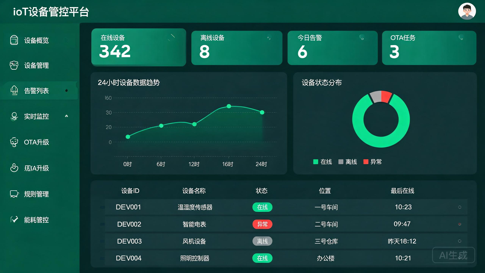
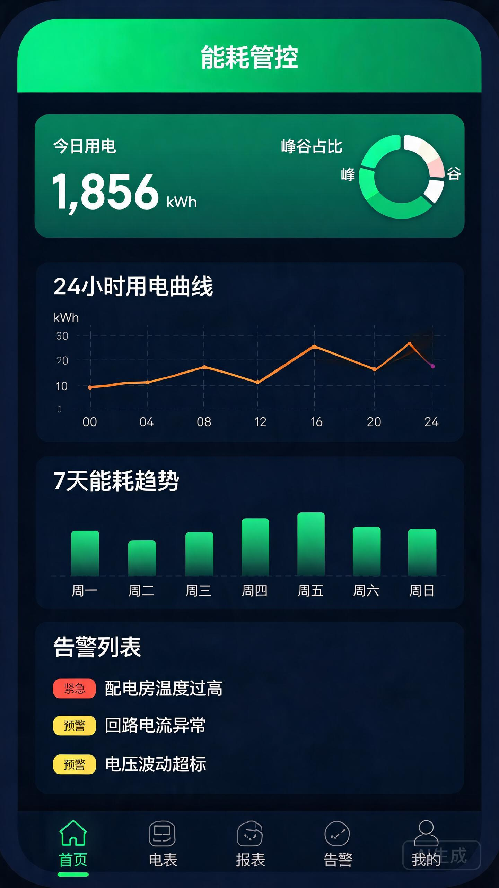

<p align="center">
  
  
  
  
  
  
  
</p>

# IoT 设备接入管控平台

> 面向中大型企业的 **SaaS 级** 物联网设备接入与管控平台，支持多租户隔离、Kafka 削峰、读写分离、自动扩缩容，单集群支撑百万设备接入与实时管控。

---

## 平台概览



平台采用 **多租户 + 微服务就绪** 架构，设备通过 MQTT 接入，经 Kafka 削峰后异步落库，支持水平扩展至 3~10 个实例。

### 核心能力一览

| 能力 | 实现方案 | 说明 |
|------|---------|------|
| 多租户隔离 | MyBatis-Plus TenantLineInterceptor + `tenant_id` | 行级数据隔离，SQL 自动注入租户条件 |
| 消息削峰 | Kafka 3 分区 + 异步消费 | 设备数据先入 Kafka 再落库，10k+ msg/s |
| 读写分离 | dynamic-datasource + MySQL 主从 | 读操作路由从库，写操作走主库 |
| 水平扩展 | K8s HPA + EMQX 共享订阅 | 3~10 Pod 自动扩缩容 |
| 限流防护 | Redis + AOP `@RateLimit` | 接口级限流，防止恶意请求 |
| 安全防护 | CORS + XSS 过滤 + JWT | JWT 携带租户上下文 |
| 监控运维 | Actuator + Prometheus + Grafana | P99 延迟、JVM 内存、设备在线数 |
| 生产部署 | Docker 多阶段 + K8s + CI/CD | 全自动构建→推送→部署 |

---

## 前端可视化看板

平台包含 **PC 管理台** 和 **移动端 H5** 两套前端界面，纯 HTML/CSS/JS 单文件，无需构建工具。

### PC 管理台

<p align="center">
  <a href="frontend/index.html">
    
  </a>
</p>

功能模块：设备概览、设备管理、告警列表、实时监控（折线图 + 环形仪表）、OTA 升级进度、Drools 规则管理、能源管控。

### 移动端 H5 看板

<p align="center">
  <a href="frontend/mobile.html">
    
  </a>
</p>

功能：能源概览、24h 功率曲线、峰谷平占比、7 日能耗趋势、告警列表、底部导航（首页/电表/报表/告警/我的）。

---

## 设备认证鉴权（MQTT per-device 身份验证）

采用 EMQX HTTP Auth 插件，每个设备分配独立 `deviceSecret`，连接时身份验证 + Topic ACL 控制。

```
设备 → EMQX Broker → HTTP Auth 回调 → /iot/mqtt/auth (验证身份)
                                    → /iot/mqtt/acl  (验证Topic权限)
```

| 端点 | 功能 | 说明 |
|------|------|------|
| `POST /iot/mqtt/auth` | 身份认证 | 校验 `deviceId + deviceSecret`，Redis 缓存 5min |
| `POST /iot/mqtt/acl` | Topic 授权 | 设备仅能操作 `iot/device/{自身ID}/#` |

详见 [EMQX Auth 配置文档](docs/emqx-auth-setup.md)。

---

## OTA 固件升级

| 实体 | 说明 |
|------|------|
| `Firmware` | 固件版本管理（版本号/URL/MD5/SHA256/状态：DRAFT→PUBLISHED→DEPRECATED） |
| `OtaTask` | 升级任务（全量/按产品/指定设备，立即/定时） |
| `OtaDeviceProgress` | 设备级进度（PENDING→DOWNLOADING→INSTALLING→SUCCESS/FAILED） |

MQTT 下发通道：`iot/device/{deviceId}/ota/command`

---

## Drools 规则引擎

支持 `.drl` 规则文件动态加载、热重载、CRUD 管理。

**内置规则文件：**

| 文件 | 规则数 | 覆盖场景 |
|------|--------|---------|
| `default-alarm-rules.drl` | 5 | 温度超限、低电量、信号弱、复合条件告警 |
| `energy-alarm-rules.drl` | 5 | 功率越限、峰段超标、非工作时段用电、功率因数低、能耗突增 |

规则变更后自动 `reloadRules()`，无需停机。

---

## 能源管理 SaaS 模块

| 模块 | 功能 |
|------|------|
| 电表/水表采集 | 支持 Modbus/MQTT 协议，自动判断峰(8-11h/18-21h)、谷(0-7h)、平(其他) |
| 能耗分析报表 | 日/月能耗聚合、最大需量、平均功率因数、电费计算（峰1.0/平0.6/谷0.3元/kWh） |
| 碳排放核算 | Scope 1（天然气/柴油/煤炭）+ Scope 2（外购电力 0.5810 kgCO2/kWh） |
| 负荷调度 | 峰荷削减/谷荷填充/需求响应，MQTT 下发空调调温、充电桩限功率 |
| 数据导出 | Apache POI 导出 Excel，OpenPDF 导出碳排放报告 |

---

## 技术栈

| 层级 | 技术 | 版本 |
|------|------|------|
| 基础框架 | Spring Boot | 3.2.5 |
| 开发语言 | Java | 17 |
| ORM | MyBatis-Plus | 3.5.5 |
| 消息队列 | Spring Kafka | 3.x |
| 缓存/限流 | Spring Data Redis | 3.2.5 |
| 时序数据库 | InfluxDB | 6.12.0 |
| MQTT 客户端 | Eclipse Paho | 1.2.5 |
| API 文档 | Knife4j (OpenAPI3) | 4.5.0 |
| 规则引擎 | Drools | 8.44.0.Final |
| 读写分离 | dynamic-datasource | 4.3.1 |
| JWT 认证 | JJWT | 0.12.6 |
| 导出 | Apache POI + EasyExcel + OpenPDF | 5.2.5 / 3.3.4 / 1.3.30 |
| 监控 | Micrometer + Prometheus | - |
| 部署 | Docker + Kubernetes + GitHub Actions | - |

---

## 快速启动

### 前置依赖

```bash
# MySQL 8.0+, Redis 7+, Kafka 3.x, InfluxDB 2.x, EMQX 5.x
docker run -d --name mysql -p 3306:3306 -e MYSQL_ROOT_PASSWORD=root mysql:8
docker run -d --name redis -p 6379:6379 redis:7
docker run -d --name emqx -p 1883:1883 -p 18083:18083 emqx/emqx:5
docker run -d --name kafka -p 9092:9092 -e KAFKA_ADVERTISED_LISTENERS=PLAINTEXT://localhost:9092 confluentinc/cp-kafka:latest
docker run -d --name influxdb -p 8086:8086 influxdb:2
```

### 初始化数据库

```bash
mysql -u root -p < src/main/resources/sql/init.sql
```

### 启动后端

```bash
git clone https://github.com/YuanYunYang/iot-device-platform.git
cd iot-device-platform
mvn spring-boot:run
```

### 访问

| 服务 | 地址 |
|------|------|
| 后端 API | http://localhost:8080 |
| API 文档 (Knife4j) | http://localhost:8080/doc.html |
| PC 管理台 | http://localhost:8080/frontend/index.html |
| 移动端 H5 | http://localhost:8080/frontend/mobile.html |
| 监控指标 | http://localhost:8080/actuator/prometheus |

---

## 生产部署

### Docker

```bash
docker build -t iot-platform:1.0 .
docker run -d -p 8080:8080 \
  -e SPRING_PROFILES_ACTIVE=prod \
  -e MYSQL_HOST=mysql-host \
  -e REDIS_HOST=redis-host \
  -e KAFKA_SERVERS=kafka:9092 \
  -e EMQX_HOST=emqx-host \
  iot-platform:1.0
```

### Kubernetes

```bash
kubectl apply -f k8s/deployment.yaml
# 含 HPA (3~10 Pod)、Ingress、Secret、ConfigMap
```

---

## API 概览

| 模块 | 路径 | Controller |
|------|------|-----------|
| 设备管理 | `/api/device` | `DeviceController` |
| 用户认证 | `/api/auth` | `AuthController` |
| 告警管理 | `/api/alarm` | `AlarmController` |
| 产品管理 | `/api/product` | `ProductController` |
| 监控数据 | `/api/monitor` | `MonitorController` |
| MQTT 认证 | `/iot/mqtt` | `MqttAuthController` |
| OTA 升级 | `/api/ota` | `OtaController` |
| 规则引擎 | `/api/rule` | `RuleController` |
| 能源仪表 | `/api/energy/meter` | `EnergyMeterController` |
| 能源数据 | `/api/energy/data` | `EnergyDataController` |
| 能源报表 | `/api/energy/report` | `EnergyReportController` |
| 碳排放 | `/api/carbon` | `CarbonEmissionController` |
| 碳排报告 | `/api/carbon/report` | `CarbonReportController` |
| 负荷调度 | `/api/load` | `LoadDispatchController` |
| 数据导出 | `/api/export` | `DataExportController` |

---

## MQTT Topic 规划

| Topic | 方向 | 说明 |
|-------|------|------|
| `iot/device/{deviceId}/property/post` | 设备→平台 | 属性上报 |
| `iot/device/{deviceId}/command` | 平台→设备 | 指令下发 |
| `iot/device/{deviceId}/event` | 设备→平台 | 事件上报 |
| `iot/device/{deviceId}/ota/command` | 平台→设备 | OTA 升级指令 |
| `iot/device/{deviceId}/ota/progress` | 设备→平台 | OTA 进度上报 |
| `iot/device/{deviceId}/energy` | 设备→平台 | 能源数据上报 |

---

## 项目结构

```
iot-device-platform/
├── src/main/java/com/iot/platform/
│   ├── IotPlatformApplication.java          # 启动类
│   ├── common/                              # 公共模块 (6)
│   │   ├── GlobalExceptionHandler.java      # 全局异常处理
│   │   ├── JwtUtils.java                    # JWT 工具
│   │   ├── RateLimit.java                   # 限流注解
│   │   ├── RateLimitAspect.java             # 限流切面
│   │   ├── Result.java                      # 统一响应封装
│   │   └── ResultCode.java                  # 响应码枚举
│   ├── config/                              # 配置模块 (13)
│   │   ├── MqttConfig.java                  # MQTT 配置
│   │   ├── KafkaConfig.java                 # Kafka 配置
│   │   ├── DroolsConfig.java                # Drools 规则引擎配置
│   │   ├── MybatisPlusConfig.java           # MyBatis-Plus + 多租户
│   │   ├── CorsConfig.java                  # 跨域配置
│   │   ├── XssFilter.java                   # XSS 过滤
│   │   ├── RedisConfig.java                 # Redis 缓存配置
│   │   ├── InfluxDBConfig.java              # 时序数据库配置
│   │   ├── WebSocketConfig.java             # WebSocket 配置
│   │   └── ...
│   ├── controller/                          # 控制器 (16)
│   ├── kafka/                               # Kafka 消费者
│   ├── model/
│   │   ├── dto/                             # 请求对象 (15)
│   │   ├── entity/                          # 数据库实体 (16)
│   │   ├── enums/                           # 枚举 (3)
│   │   └── vo/                              # 响应对象 (9)
│   ├── mqtt/                                # MQTT 模块 (3)
│   ├── repository/                          # Mapper 接口 (16)
│   ├── service/                             # 服务接口 (15)
│   │   └── impl/                            # 服务实现 (16)
│   ├── tenant/                              # 多租户 (2)
│   │   ├── TenantContext.java               # 租户上下文
│   │   └── TenantLineHandlerImpl.java       # 租户行处理器
│   ├── timer/                               # 定时任务
│   └── websocket/                          # WebSocket 推送
├── src/main/resources/
│   ├── application.yml                      # 应用配置
│   ├── mapper/                              # MyBatis XML (5)
│   ├── rules/                               # Drools 规则 (2)
│   │   ├── default-alarm-rules.drl
│   │   └── energy-alarm-rules.drl
│   └── sql/init.sql                         # 数据库初始化脚本
├── frontend/                                # 前端页面
│   ├── index.html                           # PC 管理台
│   └── mobile.html                          # 移动端 H5
├── k8s/deployment.yaml                      # K8s 部署清单
├── monitoring/prometheus.yml                # Prometheus 监控
├── Dockerfile                               # Docker 构建
├── docker-compose-prod.yml                 # 生产编排
└── pom.xml
```

---

## 贡献

欢迎提交 Issue 和 PR。请确保代码通过 `mvn compile` 编译验证。

## License

MIT License